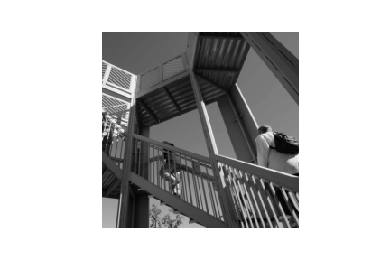
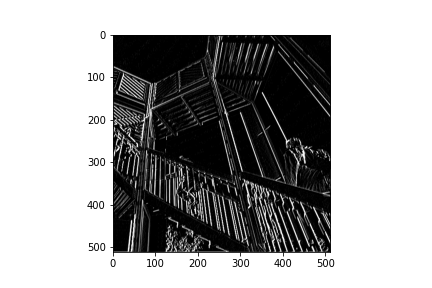
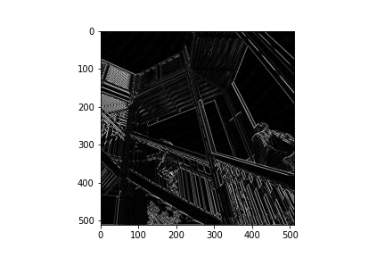
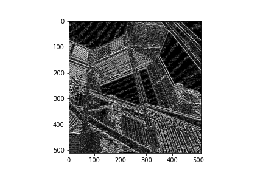
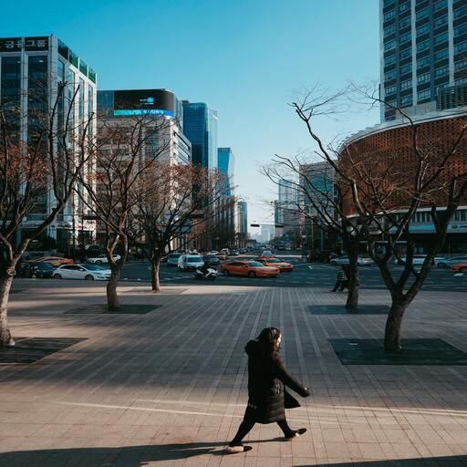
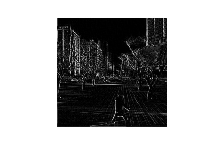
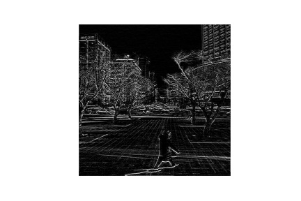
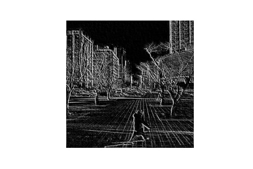

# February 21 Response

### Last time you did an exercise (convolutions and pooling) where you manually applied a 3x3 array as a filter to an image of two people ascending an outdoor staircase. Modify the existing filter and if needed the associated weight in order to apply your new filters to the image 3 times. Plot each result, upload them to your response, and describe how each filter transformed the existing image as it convolved through the original array and reduced the object size.

### Filter #1 highlights the vertical lines very strongly.

<code> filter #1: [ [5, 2, 3], [-3, 0, -3], [-1, -2, -1]] </code>

### Filter #2 seems to emphasize the horizontal lines further away from the camera.

<code> filter #2 = [ [-5, 0, 5], [2, 0, -2], [3, 0, -3]] </code>

### Filter #3 Not only emphasizes horizontal and vertical lines but it also reveals cirrostratus clouds in the background not visible in the original image. This is very cool.

<code> filter #3 = [ [20, -40, 20], [30, -60, 30], [40, -80, 40]] </code>

 What are you functionally accomplishing as you apply the filter to your original array (see the following snippet for reference)? 

Basically we take a single pixel and it's neighbors so many so that we get a 3x3 array, multiply that array by a filter, then we add all those numbers to get a new pixel value and then we repeat the process. We end up with a transformed image with the desired relevant/important features.

### Why is the application of a convolving filter to an image useful for computer vision? 

It helps by removing any unnecessary features and allows you to keep only the prominent features/ features that you deem are important. Doing this allows us to train the computer to identify features in images instead of just matching groups of pixels that look similar.

### Stretch goal: instead of using the misc.ascent() image from scipy, can you apply three filters and weights to your own selected image? Again describe the results.

### Filter #1 emphasizes the vertical lines of the image, makes it darker in the foreground which pulls attention away from it and toward the background.

<code> filter #1: [ [1, 1, 1], [-2, 0, 2], [-1, 0, -2]] </code>

### Filter #2 emphasizes horizontal lines, and the features of the trees making parts of the building more difficult to see.

<code> filter #2 = [ [-5, 0, 5], [1, 3, -2], [-1, 0, -1]] </code>

### Filter #3 emphasizes the horizontal and vertical lines. Even the lines on the pathway that the woman walks on are more visible now when compared to the other two filters.

<code> filter #3 = [ [2, 4, 2], [1,-2,1], [-4, -8, 4]] </code>

### Another useful method is pooling. Apply a 2x2 filter to one of your convolved images, and plot the result.

### In effect what have you accomplished by applying this filter? Does there seem to be a logic (i.e. maximizing, averaging or minimizing values?) associated with the pooling filter provided in the example exercise (convolutions & pooling)? Did the resulting image increase in size or decrease? Why would this method be useful? Stretch goal: again, instead of using misc.ascent(), apply the pooling filter to one of your transformed images.

### Convolve the 3x3 filter over the 9x9 matrix and provide the resulting matrix. link to matrices
